# What Shortcut does: a visual tour

Shortcut is a small Mac app for teaching staff. While you present a quiz, it
reads the question on your screen, works out the answer from your course
materials, and shows it to you alone in the menu bar. You can also ask it
anything about the course from a pop-up chat box.

Every screenshot here comes from the real app running on a Mac. The course,
questions and notes are **made-up demo material** (in
[`docs/demo`](demo/)). Each answer shown was produced live by Claude and
matched the expected answer.

There are three ways to use it:

1. [**Menu bar**](#1-the-menu-bar): press both Option keys and the answer
   appears as a small badge at the top of the screen.
2. [**Quick chat**](#2-quick-chat): double-tap Option to ask a question
   without leaving your slides.
3. [**Main window**](#3-the-main-window): choose your course folders and
   read the full conversation.

---

## 1. The menu bar

Put the quiz on screen and press **left Option + right Option** together.
Shortcut captures the window in front, checks the question against your
course files, and shows the answer as a badge in the menu bar. Only you see
it; the app or web page underneath receives no key presses.

Click the badge for the reasoning, with a ✓ or ✗ for every option:

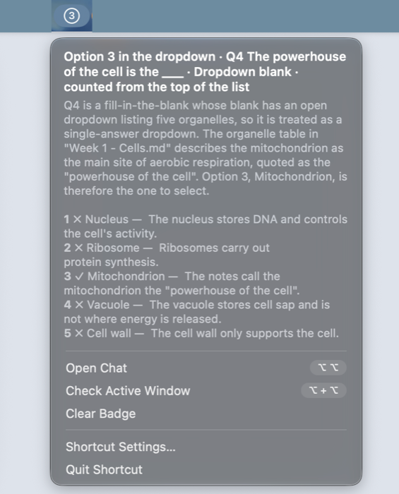

The badge changes with the question type:

| Question | Badge | What it means |
|---|---|---|
| Single answer |  | Choose B |
| Multiple response | 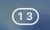 | Tick 1 and 3 |
| True / false |  | False |
| Dropdown (list open) | 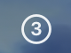 | The 3rd item from the top of the list |
| Ranking | 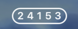 | The options in order, first to last |
| Matching |  | The choice for item 1, 2, 3, 4 |
| Number | 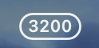 | Type 3200 |
| Free-text blanks |  | The words are in the menu and the chat |
| No answer |  | No complete question on screen; the menu says why |

While Claude is working, the circle spins. A check takes a few seconds.

### Each question type in action

In each picture, the quiz window is on the left. On the right is the same
check as it appears in the chat box: the captured screenshot, the answer and
the explanation.

**Single answer.** The answer is taken from the course notes and cites the
file it came from.

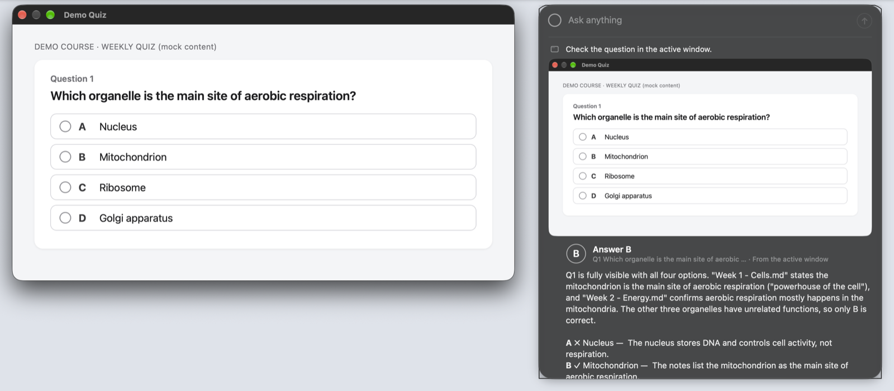

**Multiple response.** Every option is judged on its own, including
negatives such as "NOT found in animal cells".

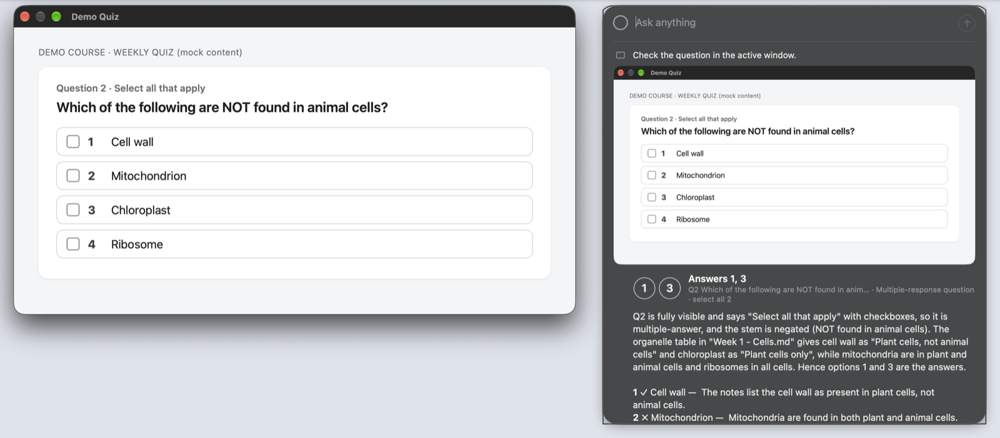

**True / false**

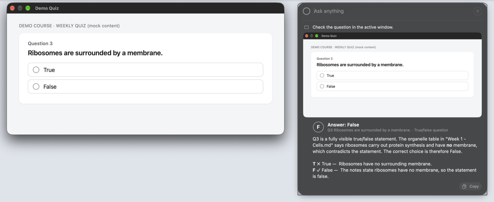

**Dropdown.** With the list open, the badge gives the position in the list,
counted from the top.

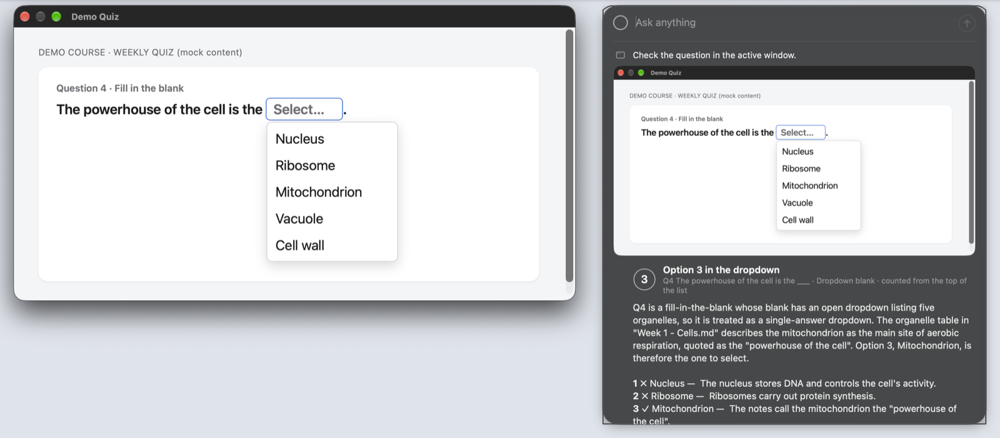

**Ranking.** The badge lists the option numbers in the right order. The
order currently on screen is ignored.

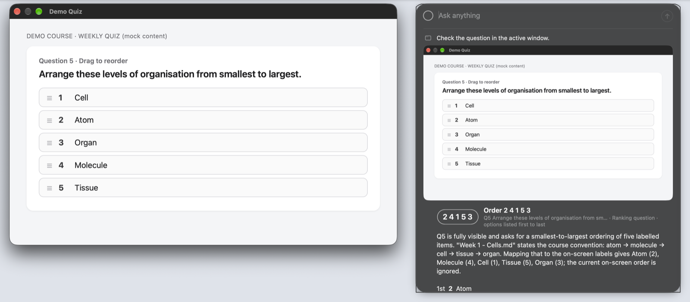

**Matching.** One choice per item, in item order.

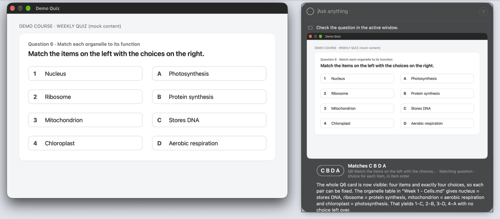

**Number**

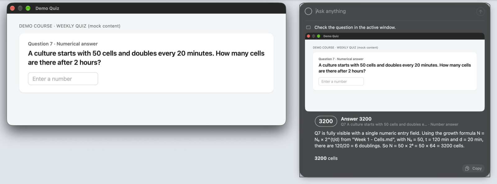

**Free-text blanks.** The text for each blank is in the chat and the menu.

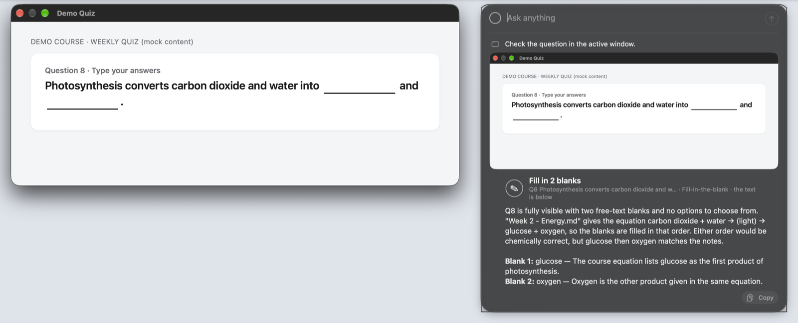

**Several questions on one page.** Shortcut answers the first question that
is fully visible and not yet finished. Here it skips question 9 (already
marked correct) and answers question 10.

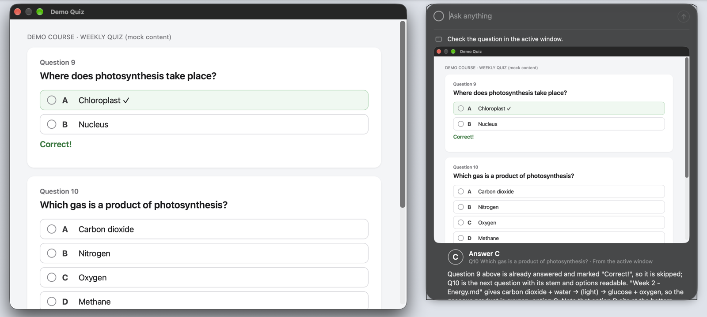

**No answer instead of a guess.** Shortcut refuses rather than guesses when
there is no question on screen, or when part of the question is cut off.

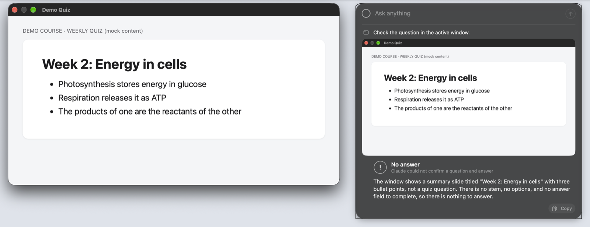

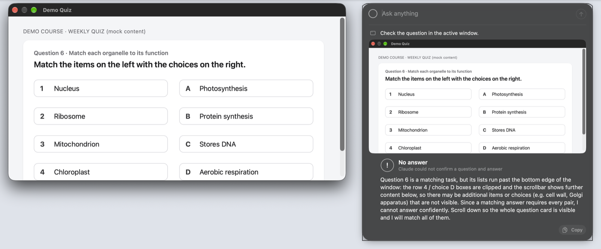

---

## 2. Quick chat

**Double-tap Option** anywhere to open the chat box over whatever you are
presenting. Type a question and press Return. Escape or a click elsewhere
closes it. You can paste images with ⌘V, and drag the box to wherever you
want it.

The box shows only the latest question and answer. Answers come from your
course files first and say which file they used.

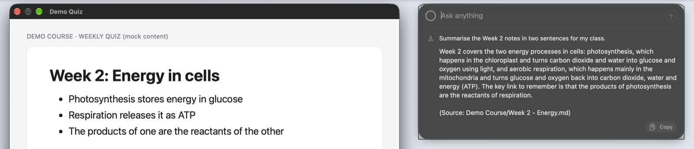

---

## 3. The main window

Open it from the menu (**Shortcut Settings…**). On the left:

- **Permission checks.** The pills turn to ✓ once macOS has granted
  Accessibility and Screen Recording.
- **Reference folders.** Every file in the folders you add is loaded, and
  each file shows whether it is ready. **Verify** asks Claude to list what
  it can see.
- **Gesture reminder.** The two key gestures, at the bottom.

On the right is the one shared conversation: every quick-chat question and
window check, with full explanations. **Reset Conversation** starts a new
one and keeps your folders. **Prompts…** shows exactly what is sent to
the model and lets you adjust the instructions. **Models…** holds the
ranked model list: Claude Code, API keys for Anthropic, OpenAI, Gemini,
OpenRouter and others, or a local Ollama or LM Studio model. The first
available model answers and the next one takes over if it fails; each reply
names the model that wrote it.

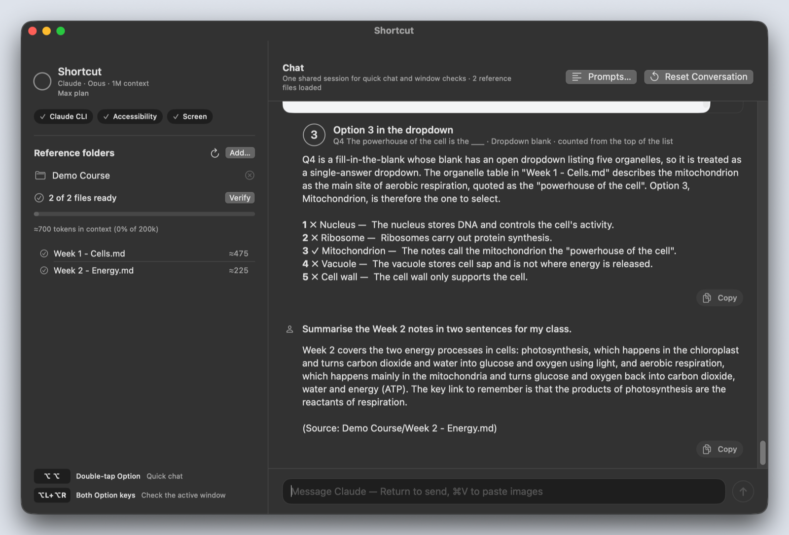

---

## Good to know

- Shortcut is personal-use software: you build it on your own Mac and it
  uses your own claude.ai plan or API keys. See the [README](../README.md) to set it up,
  or ask a coding agent to follow [AGENTS.md](../AGENTS.md).
- A window check sends a screenshot of **whatever window is in front**.
  Make sure that is the quiz, not your email or notes.
- Your course files, screenshots and chat are sent to the model provider
  that answers (Anthropic's Claude by default; local models stay on your
  Mac). Only add material you are comfortable sharing that way.
- The demo material and the quiz viewer used for these screenshots are in
  [`docs/demo`](demo/). You can use them to test your own setup.
